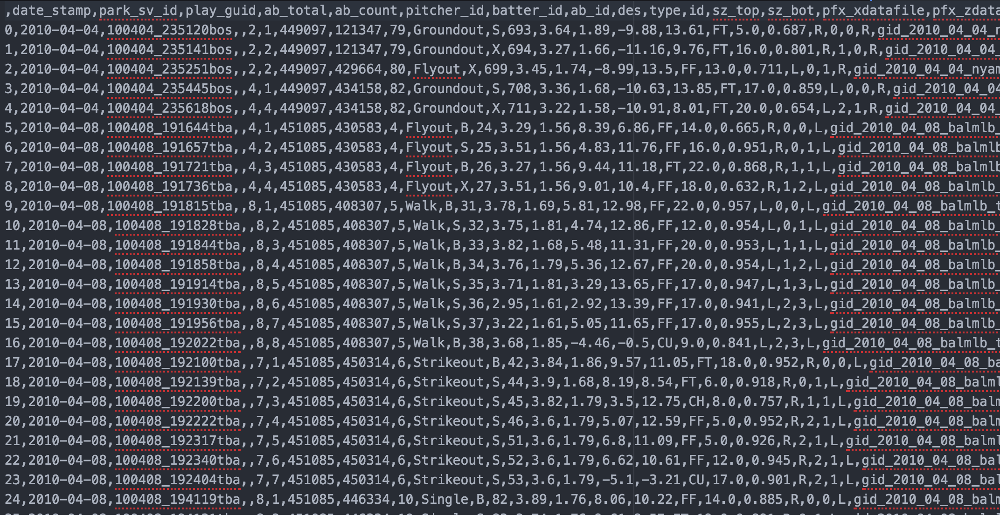
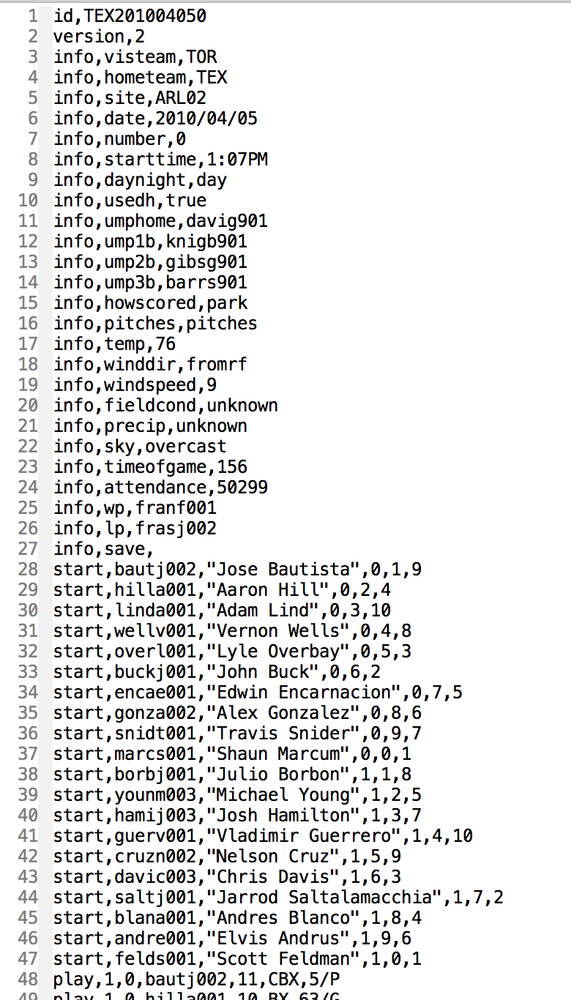
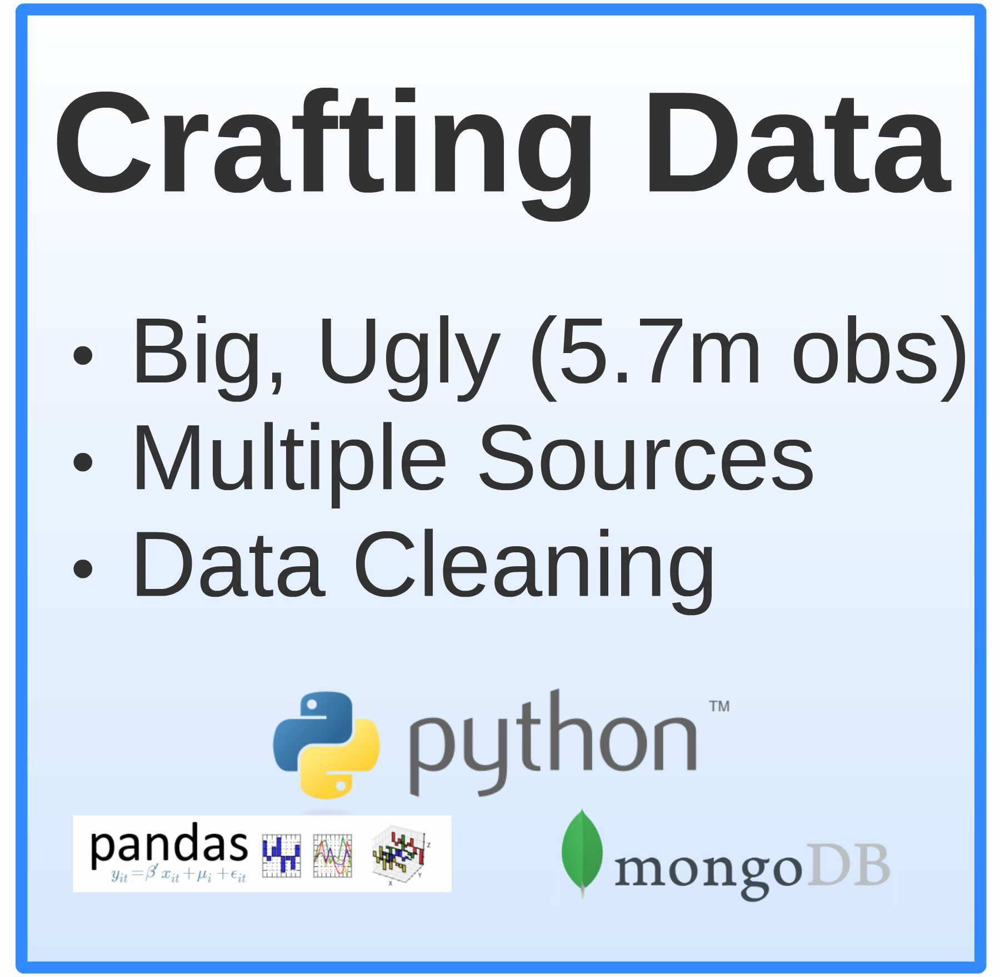
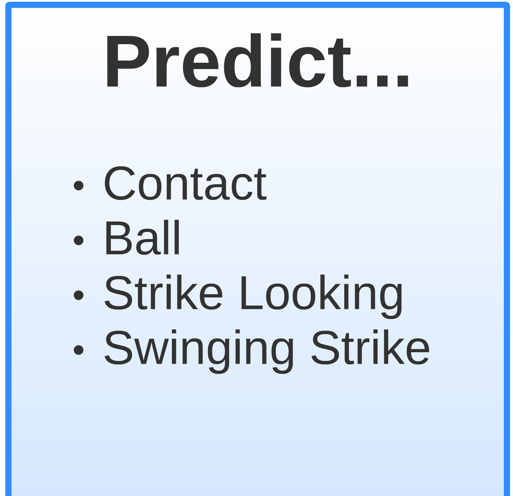
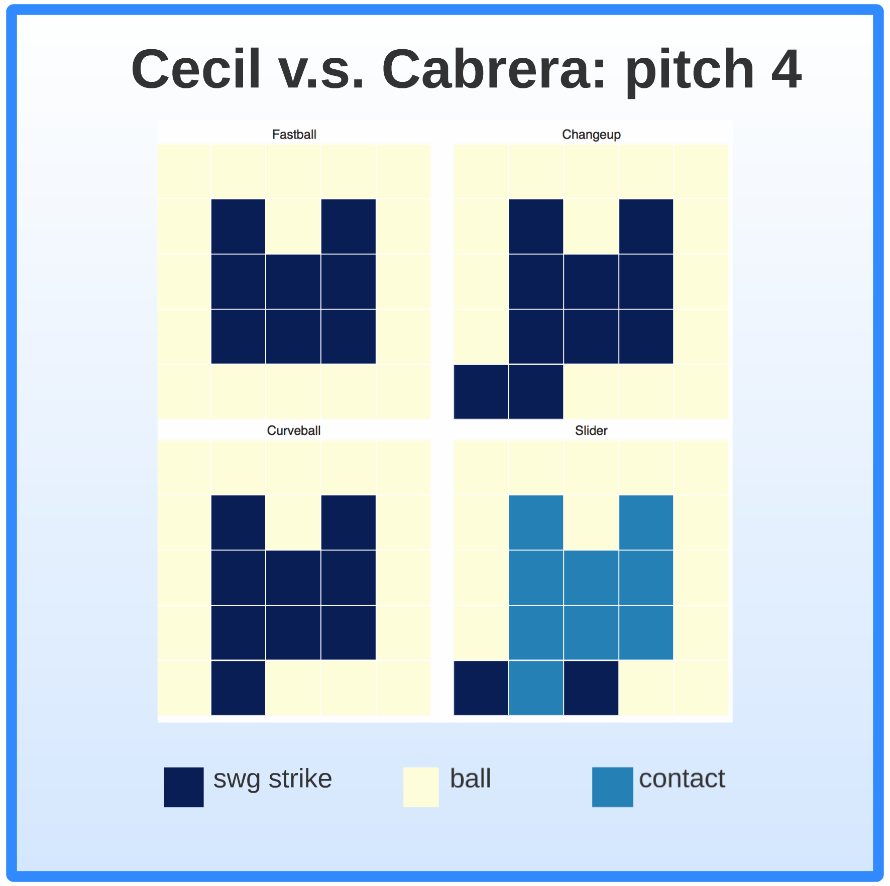
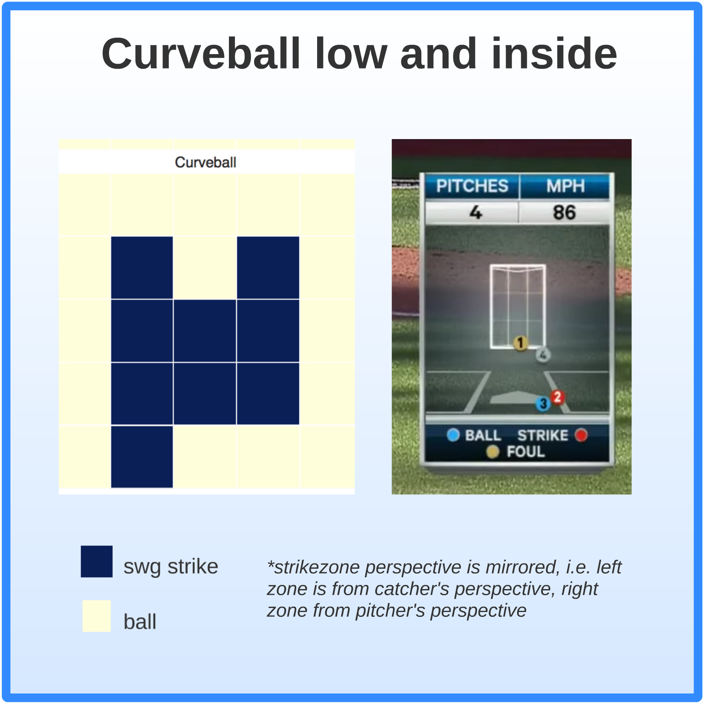

# Clutch-Pitch-PITCHf-x

### PITCHf/x

Introduced in 2006 by Major League Baseball and Sportsvision, Inc., pitchF/X ollects highly detailed data of every pitch thrown in every MLB game, including speed, location, spin, movement, etc.

# Data

I had to combine and clean a large dataset from three sources:

###1. pitchF/X data
Source: [BrooksBaseball](http://www.brooksbaseball.net/)

Big and messy, I loaded this into a Python Pandas dataframe for easy manipulation and access, as it crashed my text editor when I tried to open the .csv directly.

###2. Game-by-game data
Source: [Retrosheet](http://www.retrosheet.org/game.htm)

Again, this is a portion of the data for a single game for a single team for a single year.  

Since I wanted only weather data, I parsed these files automatically using a custom Python script (*parse_weather_info.py*)
You might notice in the script, as the data I wanted was parsed, I fed it into a Mongo database.  Then, I exported it as a .csv to Pandas (.csv was more convenient than .json).

###3. Batter performance data
Source: [Retrosheet](http://www.retrosheet.org/gamelogs/index.html), [Smart Fantasy Baseball](http://www.smartfantasybaseball.com/tools/)

This data is similarly messey to the other two.  I used Pandas to clean and eventually merge with my master dataframe.

# Data decisions

(see: *build_dataFrame.py*)

Now I had my dataset, I had to incorporate further cleaning.  Prepping the data for supervised machine learning models, I took the following steps:

* Use domain knowledge to make binning decisions, e.g. binning pitch types as "slider", "curveball", "fastball", "changeup", and make sure there was not a minority class problem (there was not, in this case).
* Dummify classification features, e.g. "sky" (dome, cloudy, overcast, sunny)
* One-hot-encode my dependent variable, breaking up into 4 features ("ball", "call_strike", "swg_strike", "contact")
* Add complementary features, e.g. adding a "first pitch" boolean feature to account for the fact that for the first pitch of the inning, the values for the "delta_[pitchInfo]" were 0.

# Creating non-parametric, supervised models

With the data complete, it was time to create models.  Models tested were:

* Random Forest Classifier ([SKLearn](http://scikit-learn.org/stable/modules/generated/sklearn.ensemble.RandomForestClassifier.html))
* Gradient Boost ([XGBoost](http://xgboost.readthedocs.org/en/latest/model.html))
* Neural Network ([Keras](http://keras.io/))

The code for these models is here: (*run_random_forest.py*, *run_XGboost.py*, *run_neural_net.py*), and the models themselves are saved as .pkl (pickle) files which can be unpacked and used to make predictions for fresh data.

For the ensemble methods, I used a gridsearch to determine the ideal hyperparameters.  For the Neural Net, I used hyper-paramaters appropriate for a 4-category classifier.

The feature importance from the random forest was used to provide a quick snapshot of what was going on with my data.

Ambivalent to the type of error (false positive or negative)(I had no cost matrix or other special considerations), I simply wanted the prediction to be correct, so I focused on the **accuracy** metric to eveluate my models.

# Plotting predictions on a heat map

(see: *build_heat_map.py*)

Above is the result of plotting the outcomes predicted by my model.  The process:
1. Select a random pitch from my hold-out data 
2. Create data for 4 simulated pitch types, each thrown to one of 25 areas in the strike zone, for a total of 100 predicted zones.  These simulated values were derived from the aggregates of the pitcher who threw the pitch, given the pitch type (the **GroupBy** functionality in Pandas).
3. Use Matplotlib and Seaborn to create the heatmap

# Comparison of heatmap and result of pitch

*Note: soon, I will alter my heatmap to the strikezone oreintation to be from the pitcher's perspective, where the similarity of the prediction and actual pitch will be more readily apparent.*

